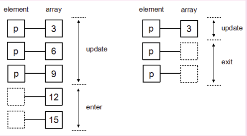
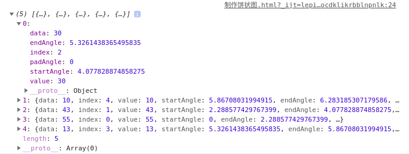
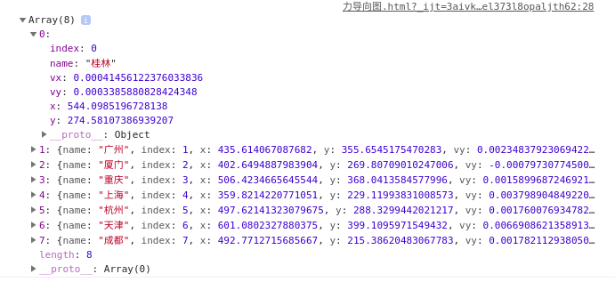
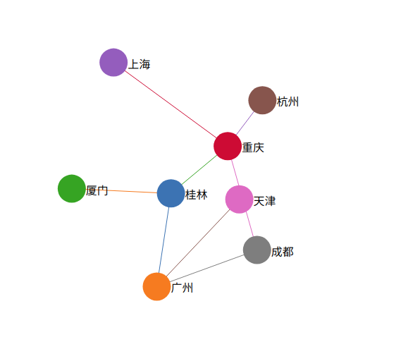
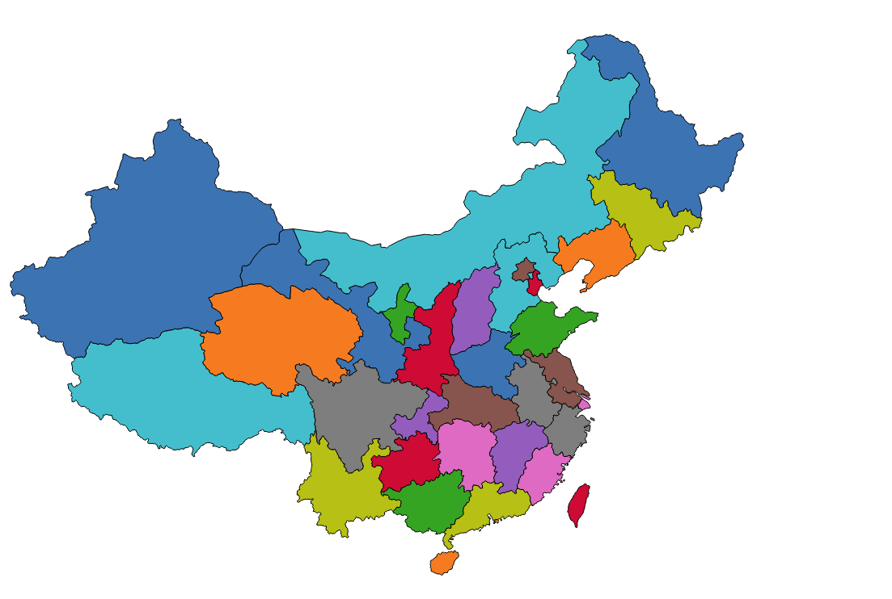
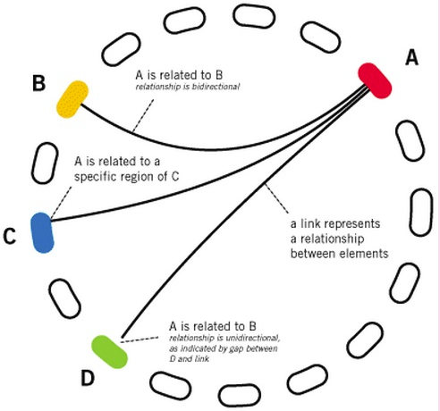
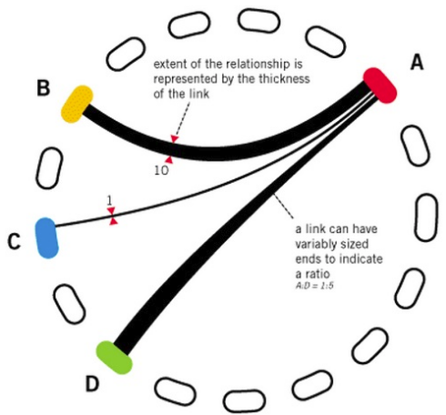
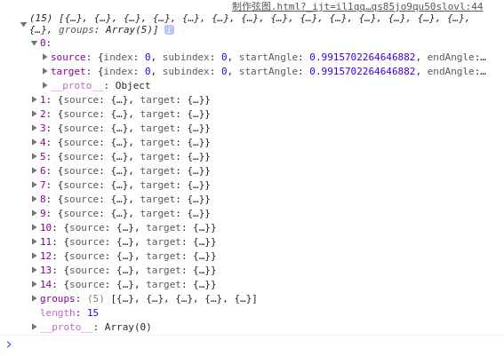
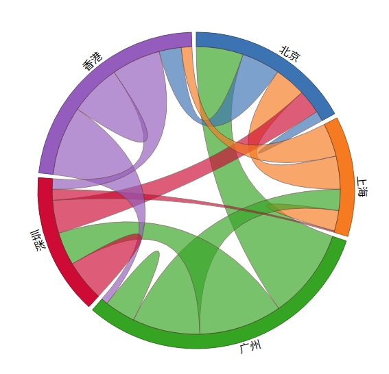
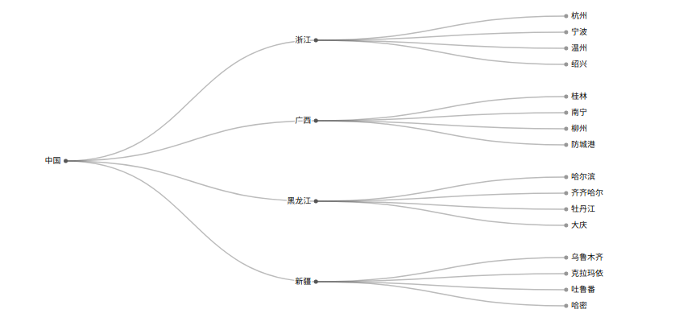

## 学习D3.js
### 1. 元素选择
html代码：
``` html
<html>
  <head>
    <title>元素选择</title>
  </head>
  <body>
    <p>hello world!!</p>
    <p>你好！！</p>
  </body>
</html>
```
javascrip代码：
``` js
// 修改内容
let p = d3.select('body')
  .selectAll('p')
  .text('这个鱼塘被我承包了！');

// 修改段落的颜色和字体大小
p.style('color', 'red')
  .style('font-size', '28px');
```
> 选择第一个元素

使用select，参数传入要选择的元素即可：
``` js
let p1 = body.select('p');
p.style('color', 'red');
```
> 选择所有元素

使用selectAll()方法选择所有要选择的元素，传入要选择的元素即可：
``` js
let p = body.selectAll('p');
p.text('hello!');
```
> 通过id选择元素，class也是一样
``` js
let p1 = body.select('#test');
```
### 2. 绑定数据
html代码：
``` html
<html>
  <head>
    <title>元素选择</title>
  </head>
  <body>
    <p>Apple</p>
    <p>Pear</p>
    <p>Banana</p>
  </body>
</html>
```
> 如何绑定数据

D3通过以下两个函数绑定数据
- datum(): 绑定一个数据到选择集上
- data(): 绑定一个数组到选择集上，数组的各项值分别与选择集各元素绑定

**1. datum()**

假设有一个字符串China,要将此字符串分别与三个段落元素绑定，代码如下：
``` js
let str = China;
let body = d3.select('body');
let p = body.selectAll('p');
p.datum(str);
p.text(function(d, i){
  return '第' + i + '个元素绑定的数据是' + d;
});
```
在上面的代码中用到了一个匿名函数`function(d, i){}`,当选择集需要使用被绑定的数据时，常需要这么做，其中包含两个参数：
- d 代表数据(data),也就是与某元素绑定的数据
- i 代表索引(index),代表数据的索引号，从0开始

**2. data()**

有一个数组，接下来要分别将数组的各元素绑定到三个段落元素上
``` js
let dataset = ['I like dogs', 'I like cats', 'I like you!'];
```
绑定之后，对应的关系应为：
- Aplle与dataset[0]绑定
- Pear与dataset[1]绑定
- Banana与dataset[2]绑定

``` js
let body = d3.select('body');
let p = body.selectAll('p');
p.data(dataset)
  .text(function(d, i){
    return d;
  });
```
### 3. 插入元素
插入元素的函数有两个：
- append(): 在选择集末尾插入元素
- insert(): 在选择集前面插入元素

**1. append()**
``` js
body.append('p')
  .text('在后面插入了一个元素！');
```
**2. insert()**

在body中id为test的元素前面添加一个段落元素
``` js
bodi.insert('p', '#test')
  .text('在id为test的元素前面插入了一个元素！');
```
### 4. 删除元素
使用remove()方法删除元素
``` js
let p = body.select('#test');
p.remove();
```
### 5. 制作简单图表
> 添加画布

推荐使用SVG做图，但是还是应该根据实际情况选择是SVG还是Canvas作画布

使用D3在body元素中添加SVG画布：
``` js
let width = 300;
let height = 300;
let svg = d3.select('body')
  .append('svg')
  .attr('height', height)
  .attr('widht', width);

  let dataset = [250, 210, 170, 130, 90]; // 数据

  let rectHeight = 25;
  svg.selectAll('rect')
  .data(dataset)
  .enter()
  .append('rect')
  .attr('x', 20)
  .attr('y', function (d, i) {
    return i * rectHeight;
  })
  .attr('width', function (d) {
    return d;
  })
  .attr('height', rectHeight - 2)
  .attr('fill', 'steelblue');
```
效果如下：


### 6. 比例尺的使用
前面制作了一个柱形图，当时有一个数组：
``` js
let dataset = [250, 210, 170, 130, 90]；
```
绘图的时候就是直接使用的里面的数据值作为矩形的宽度，此方法非常具有局限性，如果数值过大或者过小，例如：
``` js
let dataset_1 = [2.5, 2.1, 1.7, 1.3, 0.9];
let dataset_2 = [2500, 2100, 1700, 1300, 900];
```
对于以上两个数组，就不能直接使用数值当画布的宽度。

于是我们需要一种计算关系，能够：
***将某一区域的值映射到另一个区域，其大小关系不变！***
这就是比例尺
> 有哪些比例尺

D3的比例尺，也有定义域和值域，分别被称为domian和range。开发者需要指定domain和range的范围，由此得到一个计算关系。

D3提供了多种比例尺，下面介绍最常用的两种。

**1. 线性比例尺**

线性比例尺，能够将一个连续的区间映射到另一区间。要解决柱形图宽度的问题，就需要线性比例尺。

假设有以下数组：
``` js
let dataset = [1.2, 2.3, 0.9, 1.5, 3.3];
```
现有要求如下：

***将dataset中最小的值，映射成0；最大的值，映射成300.***

代码如下：
``` js
let min = d3.min(dataset);
let max = d3.max(dataset);
let linear = d3.scaleLinear() // D3第三版是d3.scale.linear()
  .domian([min, max])
  .rangle([0, 300]);
linear(0.9);  // ->0
linear(2.3);  // ->175
linear(3.3);  // ->300
```
**2. 序数比例尺**

有时候，定义域和值域不一定是连续的。
``` js
let index = [0, 1, 2, 3, 4];
let color = ['red', 'blue', 'green', 'yellow', 'black'];
let ordinal = d3.scaleOrinal()  // D3第三版是d3.scale.ordinal()
  .domain(index)
  .range(color);
ordinal(0); // -> red
ordinal(2); // -> green
ordinal(4); // -> black
```
> 给柱形图添加比例尺

修改数据，再定一个线性比例尺
``` js
let dataset = [2.5, 2.1, 1.7, 1.3, 0.9];
let linear = d3.scaleLinear()
  .domain([0, d3.max(dataset)])
  .range([0, 300]);
let rectHeight = 25;
svg.selectAll('rect')
  .data(dataset)
  .enter()
  .append('rect')
  .attr('x', 20)
  .attr('y', function(d, i){
    return i * rectHeight;
  })
  .attr('width', function(d){
    return linear(d); // 在这里使用比例尺
  })
  .attr('height', rectHeight - 2)
  .attr('fill', 'steelblue');
```
### 7. 坐标轴
D3提供了现成的坐标轴组件，非常简单。
> 坐标轴由什么构成

在SVG画布预定义的元素里，有六种基本图形：
- 矩形
- 圆形
- 椭圆
- 线段
- 折线
- 多边形

另外，还有一种比较特殊，也是功能最强的元素：
- **路径**

我们可以用其他元素来组合成坐标轴，最终使其变成类似于以下的形式：
``` html
<g>
  <!-- 第一个刻度 -->
  <g>
    <line></line> <!-- 第一个刻度的直线 -->
    <text></text> <!-- 第一个刻度的文字 -->
  </g>
  <!-- 第二个刻度 -->
  <g>
    <line></line> <!-- 第二个刻度的直线 -->
    <text></text> <!-- 第二个刻度的文字 -->
  </g>
  ...
  <!-- 坐标轴的轴线 -->
  <path></path>
</g>
```
但是如果手动添加这些元素就太麻烦了，D3提供了一个组件：`d3.svg.axis()`。它为我们完成了以上工作。
> 定义坐标轴

要生成坐标轴就要用到比例尺，添加一个坐标轴组件代码

**v5版本**
``` js
let linear = d3.scaleLinear()
  .domain([0, d3.max(dataset)])
  .range([0, 250]);
let axis = d3.axisBottom(linear)
  .ticks(7);
```

(v3版本)：
``` js
let axis = d3.svg.axis()
  .scale(linear)  // 指定比例尺
  .orient('bottom') // 指定刻度的位置
  .ticks(7) // 指定刻度的数量
```
代码解读：
1. `d3.svg.axis()`: D3中坐标轴的组件，能够在SVG中生成坐标轴的元素。
2. `scale()`: 指定比例尺。
3. `orient()`: 指定刻度的位置，bottom表示在坐标轴的下方。
4. `ticks()`: 指定刻度的数量。
> 在SVG中添加坐标轴

定义了坐标轴之后，只需要在SVG中添加一个分组元素，再将坐标轴的其他元素添加到这个里面即可：
``` js
svg.append('g')
  .call(axis);
```
在D3中，call()的参数是一个函数。他会将当前选择集当作参数传递给call()的形参。即：
``` js
svg.append('g').call(axis);
```
与
``` js
axis(svg.append(g));
```
是相等的。
> 设定坐标轴的样式和位置

默认的坐标轴样式不太美观，下面提供一个常见的样式：
``` html
<style>
.axis path,
.axis line {
  fill: none;
  storke: black;
  shape-rendering: crispEdges;
}

.axis text {
  font-family: sans-serif;
  font-size: 11px;
}
</style>
```
坐标轴的位置，可以通过transform属性来设定。改进后代码：
``` js
svg.append('g')
  .attr('class', 'axis')
  .attr('transform', 'translate(20, 130)')
  .call(axis);
```
效果图如下：


-------
### 8. 完整的柱形图
一个完整的柱形图包含三个部分：矩形、文字、坐标轴。下面代码内容包括：选择集、数据绑定、比例尺、坐标轴等内容。

> 添加SVG画布

``` js
// 画布大小
var width = 400;
var height = 400;

//在 body 里添加一个 SVG 画布
var svg = d3.select("body")
    .append("svg")
    .attr("width", width)
    .attr("height", height);

//画布周边的空白
 var padding = {left:30, right:30, top:20, bottom:20};
```
> 定义数据和比例尺

``` js
//定义一个数组
var dataset = [10, 20, 30, 40, 33, 24, 12, 5];

//x轴的比例尺
var xScale = d3.scaleBand()
    .domain(d3.range(dataset.length))
    .rangeRound([0, width - padding.left - padding.right]);

//y轴的比例尺
var yScale = d3.scaleLinear()
    .domain([0,d3.max(dataset)])
    .range([height - padding.top - padding.bottom, 0]);
```
> 定义坐标轴

``` js
// 定义x轴
let xAis = d3.axisBottom(xScale);
// 定义y轴
let yAis = d3.axisLeft(yScale);
```
> 添加矩形和文字元素

``` js
//矩形之间的空白
var rectPadding = 4;

//添加矩形元素
var rects = svg.selectAll(".MyRect")
        .data(dataset)
        .enter()
        .append("rect")
        .attr("class","MyRect")
        .attr("transform","translate(" + padding.left + "," + padding.top + ")")
        .attr("x", function(d,i){
            return xScale(i) + rectPadding/2;
        } )
        .attr("y",function(d){
            return yScale(d);
        })
        .attr("width", xScale.step() - rectPadding )
        .attr("height", function(d){
            return height - padding.top - padding.bottom - yScale(d);
        });

//添加文字元素
var texts = svg.selectAll(".MyText")
        .data(dataset)
        .enter()
        .append("text")
        .attr("class","MyText")
        .attr("transform","translate(" + padding.left + "," + padding.top + ")")
        .attr("x", function(d,i){
            return xScale(i) + rectPadding/2;
        } )
        .attr("y",function(d){
            return yScale(d);
        })
        .attr("dx",function(){
            return (xScale.step() - rectPadding)/2;
        })
        .attr("dy",function(d){
            return 20;
        })
        .text(function(d){
            return d;
        });
```
> 添加坐标轴的元素

``` js
//添加x轴
svg.append("g")
  .attr("class","axis")
  .attr("transform","translate(" + padding.left + "," + (height - padding.bottom) + ")")
  .call(xAxis);

//添加y轴
svg.append("g")
  .attr("class","axis")
  .attr("transform","translate(" + padding.left + "," + padding.top + ")")
  .call(yAxis);
```
坐标轴的位置要结合空白padding的值来设定。
### 9. 让图表动起来
> 实现动态的方法
D3提供了4个方法实现图形的过渡：从状态A变成状态B。

**1. transition()**

颜色变化：
``` js
.attr('fill', 'red')  // 初始颜色
.transition()         // 启动过渡
.attr('fill', 'steelblue')  // 最终颜色
```
**2. duration()**

指定过渡的持续时间，单位为毫秒。
如`duration(2000)`。

**3. ease()**

过渡方式：

- easeLinear: 普通的线性变化
- easeCircle: 慢慢地到达变换的最终状态
- easeElastic: 带有弹跳的到达最终的状态
- easeBounce: 在最终状态处弹跳几次

调用形式如：`ease(d3.easeBounce)`。

**4. delay()**

指定延迟的时间，表示一定事件之后才开始转变，单位为毫秒。此函数可以对整体指定延迟，也可以对个别指定延迟。

例一、对整体指定：
``` js
.transition()
.duration(1000)
.delay(500)
```
例二、对一个一个的图形（图形上绑定了数据）进行指定时：
``` js
.transition()
.duration(1000)
.delay(function (d, i) {
  return 200 * i;
})
```
> 实现简单的动态效果

下面将在SVG画布里面添加三个圆，圆出现之后，立即出现过度效果。

第一个圆，要求移动x坐标。
``` js
let circle = svg.append('circle')
    .attr('cx', 100)
    .attr('cy', 100)
    .attr('r', 45)
    .style('fill', 'green');
// 在一秒内将圆心坐标轴由100变为300
circle.transtion()
  .duration(1000)
  .attr('cr', 300);
```
第二个圆，要求即移动X坐标，又改变颜色。
``` js
circle.transition()
  .duration(1500)
  .attr('cx', 300)
  .style('fill', 'red');
```
第三个圆，要求即移动x坐标，又改变颜色，还改变半径。
``` js
circle.transtion()
  .duration(2000)
  .ease('bounce')
  .attr('cx', 300)
  .style('fill', 'red')
  .attr('r', 25);
```
> 给柱形图加上动态效果

对前面完整柱形图的基础上稍作修改，既可作成一个代动态效果的，有意思的柱形图。在添加文字元素和矩形元素的时候，启动过渡效果，让各柱形和文字缓慢升至目标高度，并且在目标处跳动几次。

对于文字元素，代码如下：
``` js
.attr('y', function (d) {
  let min = yScale.domain()[0];
  return yScale(min);
})
.transition()
.delay(function(d, i){
  return i * 200;
})
.duration(2000)
.ease('bounce')
.attr('y', function(d){
  return yScale(d);
})
```
### 10. 理解Update、Enter、 Exit
Update、Enter、Exit是D3中三个非常重要的概念，它处理的是当前选择集和数据的数量关系不确定的情况。

前面多次出现如下代码：
``` js
svg.selectAll('rect') // 选择svg所有的矩形
  .data(dataset)  // 绑定数组
  .enter()  // 制定选择集的enter部分
  .append('rect') // 添加足够数量的矩形元素
```
这段代码使用的情况是当以下情况出现的时候:

***有数据，而没有足够图形元素的时候，使用此方法可以添加足够的元素***

假设，在body中有三个p元素，有一数组[3, 6, 9],则可以将数组中的每一项分别与一个p元素绑定在一起。但是，有一个问题：**当数组的长度与元素数量不一致（数组长度>元素数量or数组长度<元素数量）时**。

如果数组为[3, 6, 9, 23, 15],将此数组绑定到三个p元素的选择集上。会有两个数据没有元素与之对应，这时候D3会建立两个空元素与数据对应，这个部分就被称为**Enter**。而有元素与数据对应的部分称为Update。如果数组为[3],则会有两个元素没有数据绑定，那么没有数据绑定的部分被称为Exit。示意图如下：


> Update和Enter的使用

当对应元素不足时(绑定数据数量 > 对应元素),需要添加元素(append).

现在body中有三个p元素,要绑定一个长度大于三的数组到p选择集上,然后分别处理update和enter两个部分.
``` js
let dataset = [3, 6, 9, 23, 34];
// 选择body中的p元素
let p = d3.select('body').selectAll('p');
// 获取update部分
let update = p.data(dataset);
// 获取enter部分
let enter = update.enter();
// update部分的处理:更新属性值
update.text(function () {
  return 'update' + d;
});
// enter部分的处理:添加元素后赋予属性值
enter.append('p')
  .text(function (d) {
    return 'enter' + d;
  });
```
所以，需要记住的是：
- update部分的处理方法一般是： 更新属性值
- enter部分的处理方法一般是： 添加元素后，赋予属性值
> Update和Exit的使用

当对应的元素过多时（绑定数据 < 对应元素），需要删除多余的元素。

现在body中有三个p元素，要绑定一个长度小于3的数组到p的选择集上，然后分别处理update和exit两部分。
``` js
let dataset = [3];
// 选择body中的p元素
let p = d3.select('body').selectAll('p');
// 获取update部分
let update = p.data(dataset);
// 获取exit部分
let exit = update.exit();
// update部分的处理： 更新属性值
update.text(function (d) {
  return 'update' + d;
});
// exit部分的处理： 修改p元素的属性
exit.text(function (d) {
  return 'exit';
});
// exit部分的处理通常是删除元素
exit.remove();
```
需要注意的是：
- exit部分的处理方法一般是：删除元素(remove)

### 11. 交互操作
在图形上设置一个或i多个监听器，当事件发生时，作出相应的反应。
> 什么是交互

交互，指的是用户输入了某种指令，程序接受到指令之后必须作出某种响应。对可视化图形来说，交互使图表更加生动，能表现出更多内容。

**用户用于交互的工具一般有三种：鼠标、键盘、触屏。**
> 如何添加交互

对某一元素添加交互操作十分简单。
``` js
let circle = svg.append('circle');
circle.on('click', function () {
  // 这里添加交互内容
});
```
通过on()函数添加事件监听器。在D3中，每一个选择集都有on()函数，用于添加事件监听器。

on()接受两个函数，第一个参数是监听的事件，第二个参数是监听到事件后响应的内容，是一个函数。

鼠标常用事件有：
- **click** 鼠标点击
- **mouseover** 鼠标在元素上
- **mouseout** 鼠标从元素上移开
- **mousemove** 鼠标被移动的时候
- **mousedown** 鼠标按钮被按下
- **mouseup** 鼠标按钮被松开

> **注意： 没有dblclick双击事件，要实现的话需要用（click + 延迟判定）来模拟**

键盘常用的事件有三个：

- **keydown**: 当用户按下任意键时触发，按住不放会重复触发该事件。该事件不会区分字母大小写，“A”和“a”会被视为一致。
- **keypress**: 当用户按下字符键（大小写、数字、符号、回车等）时触发，按住不放会重复，该事件区分大小写。
- **keyup**: 当用户释放键时触发，不区分字母的大小写。

触屏常用的事件：
- **touchstart**： 当触摸点被放在触摸屏上时。
- **touchmove**： 当触摸点在触摸屏上移动时。
- **touchend**： 当触摸点从触摸屏上拿开时。

### 12. 布局layout
D3总共提供了12个布局：饼状图(Pie)、力导向图(Force)、弦图(Chord)、树状图(Tree)、集群图(Cluster)、捆图(Bundle)、打包图(Pack)、直方图(Histogram)、分区图(Partition)、堆栈图(Stack)、矩阵树图(Treemap)、层级图(Hierarchy)。12个布局中，层级图(Hierarchy)不能直接使用。集群图、打包图、分区图、树状图、矩阵树图是由层级图扩展来的。这些布局的作用都是将某种数据转换成另一种数据，而转换后的数据是利于可视化的。

链接：[D3.js 布局layout](http://d3.decembercafe.org/pages/lessons/12.html)

### 13. 饼状图
> 数据

有如下数据，需要可视化：
``` js
let dataset = [30, 10, 43, 55, 13];
```
这些值不能直接绘图，需要用到布局，布局的作用就是：**计算出适合作图的数据**。

> 布局

``` js
// 定义一个布局
let pie = d3.pie();
// 赋值
let piedata = pie(dataset);
console.log(piedata);
```
输出结果如下：

如上所示，5个整数被转换成了5个对象，每个对象都有属性：**起始角度(startAngle)**和**中止角度(endAngle)**,还有原数据(data)。

值得注意的是：**布局不是要直接绘图，而是为了得到绘图所需的数据。**

> 绘制图形

在绘制图形之前，先定义一个颜色比例尺color：
``` js
// 设置一个颜色比例尺
let color = d3.scaleOrdinal()
    .domain(d3.range(dataset.length))
    .range(d3.schemeCategory10);
```
如果用原生的SVG方法来绘制，这些路径是十分难计算的，所以我们用到了一个**弧生成器**，能够生成弧的路径。
``` js
// 弧生成器
let outerRadius = 150;  // 外半径
let inneRadius = 0; // 内半径，为0就表示不是一个环状图
let arc = d3.arc()
    .innerRadius(inneRadius)
    .outerRadius(outerRadius);
```
然后在SVG中添加图形元素。先在`<svg>`里添加足够数量的分组元素`<g>`。
``` js
let arcs = svg.selectAll('g')
    .data(piedata)
    .enter()
    .append('g')
    .attr('transform', 'translate(' + (width / 2) + ',' + (width / 2) + ')');
arcs.append('path')
    .attr('fill', function (d, i) {
        return color(i);
    })
    .attr('d', function (d) {
        return arc(d);  // 调用弧生成器，得到路径值
    });
```
最后在每一个弧线中心添加文本：
``` js
arcs.append('text')
    .attr('transform', function (d) {
        return 'translate(' + arc.centroid(d) + ')';
    })
    .attr('text-anchor', 'middle')
    .text(function (d) {
        return d.data;  // 返回的是d.data
    });
```
### 14. 制作力导向图
> 数据准备

``` js
let height = 600, width = 960;
let marge = {top: 60, bottom: 60, left: 60, right: 60};
let svg = d3.select('body').append('svg')
    .attr('x', 100)
    .attr('y', 50)
    .attr('height', height)
    .attr('width', width);
let g = svg.append('g')
    .attr('tranform', 'translate(' + marge.top + ',' + marge.left + ')');

// 初始数据：
// 节点(node)和连线(edges)的数组，节点是一些城市名，连线的两端是结点的序号
let nodes = [
    {name: '桂林'}, {name: '广州'},
    {name: '厦门'}, {name: '重庆'},
    {name: '上海'}, {name: '杭州'},
    {name: '天津'}, {name: '成都'}
];
let edges = [
    {source: 0, target: 1, value: 1.3}, {source: 0, target: 2, value: 1.4},
    {source: 0, target: 3, value: 1}, {source: 3, target: 4, value: 2},
    {source: 3, target: 5, value: 0.8}, {source: 1, target: 6, value: 1.7},
    {source: 3, target: 7, value: 1.5}, {source: 1, target: 7, value: 1.5}
];
```
值得注意的是：**不同于V3版本，V5这里需要指定两个点之间的距离，也就是value,V3则需要在后面代码中指定**

> 设置一个颜色比例尺

``` js
let color = d3.scaleOrdinal()
    .domain(d3.range(nodes.length))
    .range(d3.schemeCategory10);
```
> 新建一个力导向图

``` js
// 定义一个力导向图的布局
let force = d3.forceSimulation()
    .force('link', d3.forceLink())
    .force('charge', d3.forceManyBody())
    .force('center', d3.forceCenter());
```
> 生成节点数据

``` js
force.nodes(nodes)
    .on('tick', ticked);
```
> 生成边集数据
``` js
force.force('link')
    .links(edges)
    .distance(function (d) {    // 设置每一边的长度
        return d.value * 100;
    });
```
> 设置图形中心位置
``` js
force.force('center')
    .x(width / 2)
    .y(height / 2);
```
> 输出顶点集和边集

结果如下：



> 添加连线

``` js
let links = g.append('g').selectAll('line')
    .data(edges)
    .enter()
    .append('line')
    .style('stroke', function (d, i) {
        return color(i);
    })
    .style('stroke-width', 1);
```
> 添加连线

``` js
let svg_nodes = svg.selectAll('circle')
    .data(nodes)
    .enter()
    .append('circle')
    .attr('r', 20)
    .style('fill', function (d, i) {
        return color(i);
    })
    .call(d3.drag()
        .on('start',started)
        .on('drag',dragged)
        .on('end', ended));  // 使得节点能够拖动
```
> 添加节点和文字
``` js
let svg_nodes = svg.selectAll('circle')
    .data(nodes)
    .enter()
    .append('circle')
    .attr('r', 20)
    .style('fill', function (d, i) {
        return color(i);
    })
    .call(d3.drag()
        .on('start',started)
        .on('drag',dragged)
        .on('end', ended));  // 使得节点能够拖动
// 添加描述节点的文字
let svg_texts =svg.selectAll('text')
    .data(nodes)
    .enter()
    .append('text')
    .style('fill', 'black')
    .attr('dx', 20)
    .attr('dy', 8)
    .text(function (d) {
        return d.name;  // 获取的是转换后的数据
    });
```
> ticked函数的实现
``` js
function ticked() {
    links
        .attr('x1', function (d) {
            return d.source.x;
        })
        .attr('y1', function (d) {
            return d.source.y;
        })
        .attr('x2', function (d) {
            return d.target.x;
        })
        .attr('y2', function (d) {
            return d.target.y;
        });
    // 更新节点坐标
    svg_nodes.attr('cx', function (d) {
        return d.x;
    })
        .attr('cy',function (d) {
            return d.y;
        });
    // 更新文字坐标
    svg_texts.attr('x', function (d) {
        return d.x;
    })
        .attr('y', function (d) {
            return d.y;
        })
}
```
> drag函数实现
``` js
function started(d) {
    if (!d3.event.active) {
        force.alphaTarget(0.8).restart();   // 设置衰减系数，对节点位置移动过程的模拟数值越高越快
    }
    d.fx = d.x;
    d.fy = d.y;
}
function dragged(d) {
    d.fx = d3.event.x;
    d.fy = d3.event.y;
}
function ended(d) {
    if(!d3.event.active){
        force.alphaTarget(0);
    }
    d.fx = null;
    d.fy = null;
}
```
最终效果如下：




### 15. 中国地图
> 地图的获取

获取地图链接：[china.geojosn](http://d3.decembercafe.org/demo/rm/lesson15/china.geojson)

> 创建画布

``` js
let width = 1000, height = 1000;
let svg = d3.select('body').append('svg')
    .attr('width', width)
    .attr('height', height)
    .append('g')
    .attr('transform', 'translate(0, 0)');
```
> 投影函数

``` js
let projection = d3.geoMercator()
    .center([107, 31])
    .scale(850)
    .translate([width / 2, height / 2]);
```

> 地理路径生成器

``` js
let path = d3.geoPath()
    .projection(projection);
```
> 设置颜色比例尺

``` js
let color = d3.scaleOrdinal()
    .domain(d3.range(5))
    .range(d3.schemeCategory10);
```
> 向服务器请求数据并绘图

``` js
d3.json('./china.json').then(function (data) {
    svg.selectAll('path')
        .data(data.features)
        .enter()
        .append('path')
        .attr('stroke', '#000')
        .attr('stroke-width', 1)
        .attr('fill', function (d, i) {
            return color(i);
        })
        .attr('d', path)    // 使用地理路径生成器
        .on('mouseover', function (d, i) {
            d3.select(this)
                .attr('fill', 'yellow');
        })
        .on('mouseout', function (d, i) {
            d3.select(this)
                .attr('fill', color(i))
        });
});
```
值得注意的是，在V3版本中获取json函数的返回方式不一样，V3版本是: `d3.json('url',function(error,data){console.logo(data);})`

结果如下所示：



### 16. 布局 弦图（与V3版本之间的区别太多就不指出来了）
> 弦图主要用于展示多个节点之间的联系。

两点之间的连线，表示谁和谁具有联系。



显得粗细表示权重。



> 数据

现有数据如下：
``` js
const city_name = ['北京', '上海', '广州', '深圳', '香港'];
const population = [
    [1000, 3045, 4567, 2331, 3714],
    [3214, 2000, 2060, 124, 3234],
    [8761, 6545, 3000, 8045, 647],
    [3211, 1067, 3214, 4000, 1006],
    [2145, 1034, 6745, 4764, 5000]
];
```
数据都是一些城市名和数字，关系如下：

| 城市 | 北京 | 上海 | 广州 | 深圳 | 香港 |
| ---- | ---- | ---- | ---- | ---- | ---- |
| 北京 | 1000 | 3045 | 4567 | 2331 | 3714 |
| 上海 | 3214 | 2000 | 2060 | 124  | 3234 |
| ...  | ...  | ...  | ...  | ...  | ...  |

左边第一列是被统计人口的城市，上边一行是被统计的来源城市。即：北京有1000个是本地人，有3045个来自上海....。

> 布局（数据转换）

弦图的布局定义如下：
``` js
// 布局（数据转换）
let chord_layout = d3.chord()
    .padAngle(0.03)  // 节点之间的间隔
    .sortSubgroups(d3.descending);   // 排序
chord_layout = chord_layout(population);  // 将数据转换为我们需要的形式
```
输出转换的数据：
``` js
// 应用布局转换数据
const groups = chord_layout.groups;
const chords = chord_layout;
console.log(chord_layout);
```
输出结果如下：



> 定义相关变量

``` js
const height = 600, width = 600;
const innerRadius = width / 2* 0.7;
const outerRadius = innerRadius * 1.1;
const svg = d3.select('body').append('svg')
    .attr('width', width)
    .attr('height', height)
    .append('g')
    .attr('transform', 'translate(' + width / 2 + ',' + height / 2 + ')');
// 设置颜色比例尺
let color = d3.scaleOrdinal()
    .domain(d3.range(5))
    .range(d3.schemeCategory10);
```
> 绘制节点

绘制节点（即分组，有多少个城市画多少个弧形），以及绘制城市名称。
``` js
// 外圈及文字
let outer_arc = d3.arc()
    .innerRadius(innerRadius)
    .outerRadius(outerRadius);
let g_outer = svg.append('g');
g_outer.selectAll('path')
    .data(groups)
    .enter()
    .append('path')
    .style('fill',  function (d) {
        return color(d.index);
    })
    .style('stroke', function (d) {
        return d3.rgb(color(d.index)).darker();
    })
    .attr('d', outer_arc);
g_outer.selectAll('text')
    .data(groups)
    .enter()
    .append('text')
    .each(function (d, i) {
        d.angle = (d.startAngle + d.endAngle) / 2;
        d.name = city_name[i];
    })
    .attr('dy', '.35em')
    .attr('transform', function (d) {
        return 'rotate(' + (d.angle * 180 / Math.PI) + ')' +
                'translate(0, ' + -1.0 * (outerRadius + 10) + ')' +
            ((d.angle > Math.PI * 3 / 4 && d.angle < Math.PI * 5 / 4) ? 'rotate(180)' : '');
    })
    .text(function (d) {
        return d.name;
    });
```
节点位于弦图的外部，节点数组groups的每一项都包含起始角度和终止角度，因此节点与饼图其实是相似的。

然后就是节点的文字，有两个地方需要特别注意：

- **each()**: 表示对任何一个绑定数据的元素，都执行后面的匿名函数 `function(d, i)`函数体里面做两件事：
  - 计算起始角度和终止角度的平均值，赋值给d.angle。
  - 将city_name[i]城市名称赋值给d.city_name

- **transform()的参数**： 用translate进行坐标变换时，要注意顺序： rotate -> translate(先旋转再平移)。此外：`((d.angle > Math.PI * 3 / 4 && d.angle < Math.PI * 5 / 4) ? 'rotate(180)' : '')`的意思是，当角度在135度到225度之间，旋转180度。不然下方的文字时倒的。

> 绘制连线（弦）

``` js
// 绘制连线
let inner_chord = d3.ribbon()
    .radius(innerRadius);
svg.append('g')
    .attr('class', 'chord')
    .selectAll('path')
    .data(chords)
    .enter()
    .append('path')
    .attr('d', inner_chord)
    .style('fill', function (d) {
        return color(d.target.index);
    })
    .style('opacity', 0.67)
    .style('stroke', function (d) {
        return d3.rgb(color(d.index)).darker();
    })
    .on('mouseover', function (d, i) {
        d3.select(this)
            .style('fill', 'yellow');
    })
    .on('mouseout', function (d, i) {
        d3.select(this)
            .transition()
            .duration(1000)
            .style('fill', color(d.source.index));
    });
```
运行结果如下所示：



### 17. 布局 集群图
集群图是一种表示包含与被包含关系的图表。

> 布局

定义一个集群图布局：
``` js
// 定义集群
let tree = data => {
  const root = d3.hierarchy(data)   // 从给定的层次结构数据构造一个根节点并未各个节点指定深度等属性
      .sort((a, b) => (a.height - b.height)) ||     // 排序所有的后代兄弟节点
      a.data.name.localeCompare(b.data.name);
  root.dx = 20;
  root.dy = width / (root.height + 1);
  return d3.cluster().nodeSize([root.dx, root.dy])(root);
  // d3.cluster()创建一个新的集群（系统树图）布局
  // cluster.nodeSize 设置节点尺寸
};
```
操作数据，将其转换为我们需要的格式：
``` js
const root = tree(data);
let x0 = Infinity;
let x1 = -x0;
root.each(d => {    // 广度优先遍历当前子树
    if (d.x > x1) x1 = d.x;
    if (d.x < x0) x0 = d.x;
});
```
绘制节点和路径：
``` js
const svg = d3.select('body').append('svg')
    .style('width', '100%')
    .style('height', 500);
const g = svg.append('g')
    .attr('font-family', 'sans-serif')
    .attr('font-size', 10)
    .attr('transform', `translate(${root.dy / 3}, ${root.dx - x0})`);
let link = g.append('g')
    .attr('fill', 'none')
    .attr('stroke', '#555')
    .attr('stroke-opacity', 0.4)
    .attr('stroke-width', 1.5)
    .selectAll('path')
    .data(root.links())
    .enter().append('path')
    .attr('d', d => `
      M${d.target.y},${d.target.x}
      C${d.source.y + root.dy / 2},${d.target.x}
      ${d.source.y + root.dy / 2},${d.source.x}
      ${d.source.y},${d.source.x}
    `);
const node = g.append('g')
    .attr('stroke-linejoin', 'round')
    .attr('stroke-width', 3)
    .selectAll('g')
    .data(root.descendants().reverse())
    .enter().append('g')
    .attr('transform', d => `translate(${d.y}, ${d.x})`);
node.append('circle')
    .attr('fill', d => d.children ? '#555' : '#999')
    .attr('r', 2.5);
node.append('text')
    .attr('dy', '0.31em')
    .attr('x', d => d.children ? -6 : 6)
    .text(d => d.data.name)
    .filter(d => d.children)
    .attr('text-anchor', 'end')
    .clone(true).lower()
    .attr('stroke', 'white');
```
节点路径是真的难，需要研究SVG路径，看了表示看不到懂，不管了。

最后结果如下：



### 17+. SVG \<path>标签
前面那一段代码，其中的东西结合官方api的话都还能理解，就是一些函数，但是这一砣是真的不晓得啥子意思：
``` js
M${d.target.y},${d.target.x}
C${d.source.y + root.dy / 2},${d.target.x}
${d.source.y + root.dy / 2},${d.source.x}
${d.source.y},${d.source.x}
```
通过查询在MDN（讲道理菜鸟教程写的十分抽象）上的SVG我们可以知道这个是属于\<path>标签的一个属性，下面来详细研究一下这个d属性。

#### d属性
> 该属性定义了一个路径

属性`d`实际上是一个字符串，包含了一些列路径描述。这些路径由下面这些指令组成：
- Moveto
- Lineto
- Curveto
- Arcto
- ClosePath

这些组合在一个字符串重。这些不同的命令是大小写敏感的；一个答谢的命令指明它的参数是绝对位置，而小写的命令指明相对于当前位置的点。可以指定一个负数值作为命令的参数：负角度将是逆时针的，绝对x和y位置将视为负坐标。负相对x值将会往左移，而负相对y值将会向上移。

#### Moveto

`Moveto`指令可以被想象成拿起画笔，放在另一处。在上一个点和这个点之间没有线段绘制。用一个Moveto命令开始一个路径是好的作法。因为如果没有一个初始化的Moveto,执行命令时开始点会是上一个操作发生过的地方，这样可能造成不确定的行为。

用法：
- `M x,y` 在这里x和y是绝对坐标，分别代表水平坐标和垂直坐标。
- `m dx,dy` 在这里dx和dy是相对于当前点的距离，分别是向右和向下的距离。

示例：
- 位于绝对位置x=50, y=100:`<path d = 'M50,100...'/>`
- 往右移50，往下移100：`<path d = 'm50, 100...'/>`

#### Lineto

和`Moveto`指令不同，`Lineto`指令将绘制一条直线段。这个直线段从当前位置移到指定位置。原生的`Lineto`命令的语法是"L x,y"或者"l dx, dy"，这里x和y是绝对位置，dx和dy是偏移位置。**还有字母H和V，分别指定水平和垂直移动。他们的语法与L相同**。

#### Curveto

Curveto命令指定了一个贝塞尔曲线。有两种类型的贝塞尔曲线：立方曲线和二次方曲线。二次方贝塞尔曲线是一种特殊的立方贝塞尔曲线，在这里，控制点的两端是相同的。二次方贝塞尔曲线的语法是`"Q cx,cy x,y"`或`"q dcx,xcy dx,dy"`。cx和xy都是控制点的绝对坐标。dcx和dcy分别是控制点在x和y方向上的距离。

立方贝塞尔曲线遵守二次方贝塞尔曲线同样的概念，但是它需要考虑两个控制点。立方贝塞尔曲线的语法是：`"C c1x,c1y c2x,c2y x,y"`或者`"c dc1x,dc1y dc2x,dc2y dx,dy"`，在这里，c1x、c1y和c2x、c2y分别是初始点和结束点的控制的绝对坐标。dc1x、dc1y和dc2x、dc2y都是相对于初始点，而不是相对于结束点的，dx,dy分别是向右和向下的距离。

为了连缀平滑的贝塞尔曲线，可以使用T和S命令。它们的语法比别的Curveto命令简单，因为它假定第一个控制点是从前一个控制点关于前一个点的反射，或者说如果没有前一个控制点的话它实际上就是前一个点。T的语法是`"T x,y"`或者`"t dx,dy"`，分别对应与绝对坐标和相对距离，用来创建二次贝塞尔曲线。S用来创建立方贝塞尔曲线，语法是`"S cx,cy x,y"`或者`"s dcx,dcy dx,dy"`，这里(d)cx指定第二个控制点。

最后，所有的贝塞尔曲线命令可以制作出一个多边贝塞尔图形，现初始化命令，然后多次指定所有的参数，就可以制作一个多变贝塞尔图形。

#### Arcto

有时候描诉一个椭圆弧曲线路径要比描述一个贝塞尔曲线路径更简单。说到底，path元素支持Arcto命令。圆弧的中心由别的变量急速那出。一个arcto的声明相对而言有点复Visual Studio:`"A rx,ry xAxisRotate LargeArcFlag,SweepFlag x,y"`。解构它，rx和ry分别是x和y方向的半径，而LargeArcFlag的值要么是0要么是1，用来确定是要画小弧(0)还是画大弧(1)。SweepFlag也要么是0要么是1，用来确定弧是顺时针方向(1)还是逆时针方向(0)。x和y是目的地的坐标。虽然xAxisRotate支持改变x轴相对于当前引用框架的方向但是在Gecko 7中，这个参数看起来没什么效果。

#### ClosePath
ClosePath命令将在当前路径，从当前点到第一个点简单画一条直线。他是最简单的命令，而且不带有任何参数。它沿着开始的点的最短的线性路径，如果别的路径落在这路上，将有可能路径相交。句法是`"Z"`或`"z"`，两种写法作用一样。

#### 总结

全是概念玩个毛，太抽象，看完云里雾里，需要实际的图形参考，后面再慢慢研究吧。ssssssshit!!!
